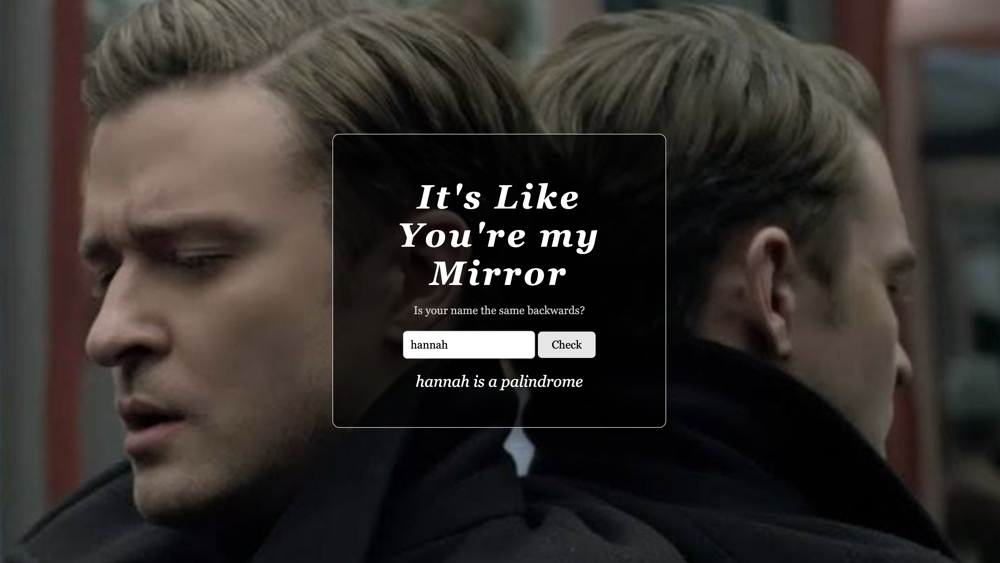

# Mirrors (Palindrome Checker)🪞

A name checker that tells you if a word or name is the same backwards, like a mirror.

## Description

This is a palindrome checker I made to practice server side JavaScript. A palindrome is a word that is spelled the same forwards and backwards, like "mom" or "level". You type a name or word into the box and click the button.

## DEMO

## Features

- Type in any name or word and click **Check**
- Tells you if it is or isn't a palindrome
- Not case sensitive, so "Anna" and "anna" both work
- An empty box counts as "not a palindrome"
- Custom Node server that serves the pages and the API

## Tech Used

- HTML
- CSS
- JavaScript
- Node.js

## How to Use

This app needs a Node server

1. Start the server:
2. Open your browser and go to localhost:8000
3. Type a name or word in the box.
4. Click **Check** to see if it's a palindrome.
5. To stop the server, press Ctrl + C in the terminal.

## How It Works

1. When you click the button, main.js grabs what you typed.
2. It sends the word to the server.
3. The server makes the word lowercase and flips it backwards (split into letters, reverse, join back together).
4. If the word isn't empty and matches its reversed version, the server sends back "yes". Otherwise it sends "no".
5. The page shows whether your word is a palindrome.

## What I Learned

- How to make a basic server with Node.js
- How to send data to the server using query parameters
- How to use `fetch` with `.then()` and `.catch()`
- How to reverse a string using `split()`, `reverse()` and `join()`
- How to use `npm install` to add packages like figlet

## Author

Maya Rose — [GitHub](https://github.com/Mayaerose) 🌹
